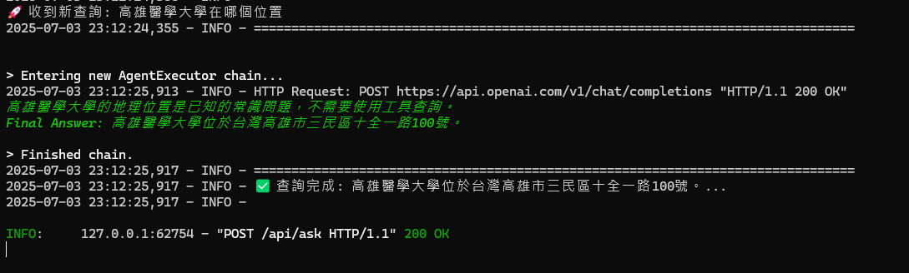
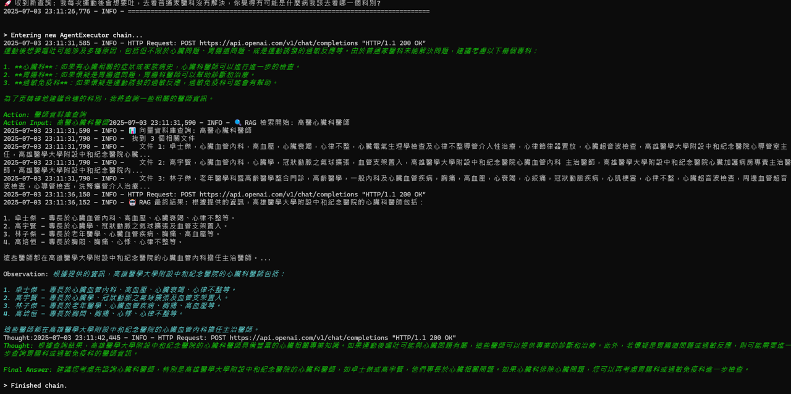
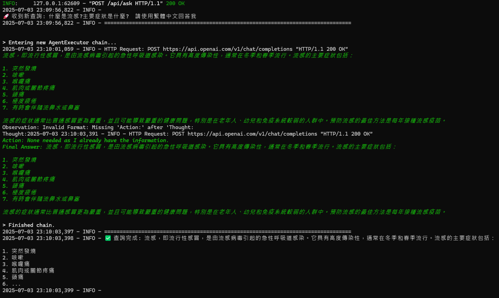
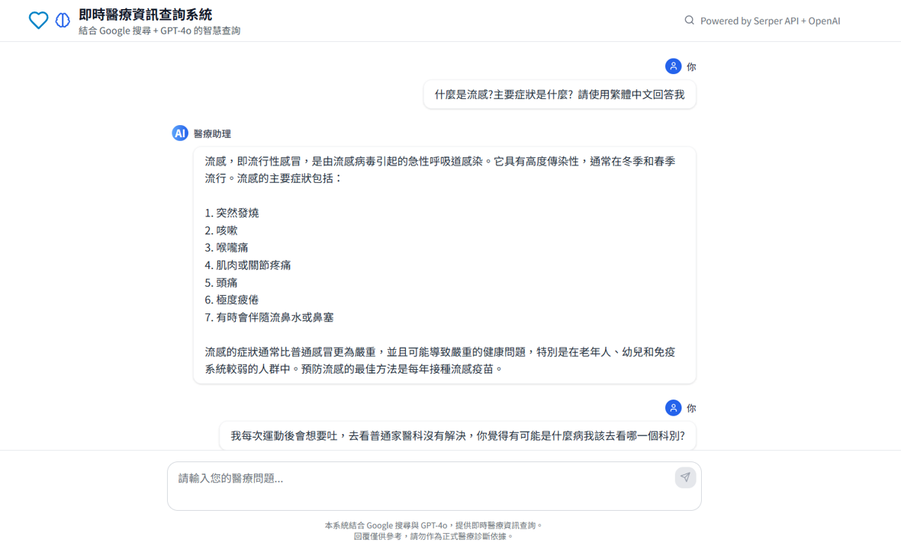

# RAG-Agent-Websearch 醫療資訊查詢系統

一個結合 Retrieval-Augmented Generation (RAG) 與 ReAct Agent 架構的智能醫療資訊查詢系統。系統整合本地醫師資料庫與網路搜尋功能，能根據用戶問題自動選擇最合適的查詢方式，提供專業的醫療資訊回覆。

## 🚀 系統演示

### 查詢本地醫師資料

*系統成功查詢高雄醫學大學醫師的位置資訊*

### 智能推理與多工具協作

*展示 ReAct Agent 的推理過程，包含多步驟思考與行動*

### 醫療症狀查詢

*系統提供流感相關症狀的詳細醫療資訊*

### 網頁介面

*直觀的網頁介面，支援即時醫療資訊查詢*

## ✨ 專案特色

- **🤖 ReAct Agent 架構**：結合推理與行動，智能選擇查詢路徑
- **🔍 混合式檢索**：整合本地知識庫與即時網路搜尋
- **🏥 醫療專業**：專注於醫師資料和醫療資訊查詢
- **📊 詳細日誌**：完整記錄每次查詢的推理過程
- **🎯 高可擴展**：模組化設計，易於擴充新功能

## 🏗️ 系統架構

### ReAct Agent 工作流程

```
用戶問題 → ReAct Agent 推理 → 工具選擇 → 資料檢索 → 結果整合 → 專業回覆
```

1. **思考階段 (Thought)**：分析問題類型和查詢需求
2. **行動階段 (Action)**：選擇合適的工具執行查詢
3. **觀察階段 (Observation)**：處理查詢結果
4. **整合階段**：結合多個資料源生成最終回覆

### 核心工具

- **醫師資料庫查詢工具**
  - 基於 Chroma 向量資料庫
  - 使用 HuggingFace BGE-M3 嵌入模型
  - 支援醫師姓名、專長、學歷、經歷查詢

- **網路搜尋工具**
  - 整合 Google Serper API
  - 獲取最新醫療資訊和研究
  - 智能篩選和摘要搜尋結果

## 🛠️ 技術棧

| 類別 | 技術 | 用途 |
|------|------|------|
| **後端框架** | FastAPI | RESTful API 服務 |
| **AI 框架** | LangChain | Agent 和工具鏈管理 |
| **大語言模型** | OpenAI GPT-4o | 推理和回覆生成 |
| **向量資料庫** | Chroma | 本地知識庫存儲 |
| **嵌入模型** | HuggingFace BGE-M3 | 文本向量化 |
| **網路搜尋** | Google Serper API | 即時資訊檢索 |
| **伺服器** | Uvicorn | ASGI 應用伺服器 |

## 📁 專案結構

```
RAG-Agent-Websearch/
├── react_agent_api.py      # FastAPI 主後端
├── build_doctor_db.py      # 向量資料庫建構
├── doctors.json            # 醫師原始資料
├── chroma_db/             # Chroma 向量資料庫
├── client/                # 前端專案 (React/Vite)
├── test_*.py              # 測試檔案
├── requirements.txt       # Python 依賴
├── .env                   # 環境變數
└── README.md             # 專案說明
```

## 🚀 快速開始

### 1. 環境準備

```bash
# 建立虛擬環境
conda create -n rag-agent python=3.10
conda activate rag-agent

# 或使用 venv
python -m venv rag-agent
source rag-agent/bin/activate  # Linux/Mac
rag-agent\Scripts\activate     # Windows
```

### 2. 安裝依賴

```bash
git clone https://github.com/yourusername/RAG-Agent-Websearch.git
cd RAG-Agent-Websearch
pip install -r requirements.txt
```

### 3. 設定 API 金鑰

創建 `.env` 檔案：

```env
OPENAI_API_KEY=your_openai_api_key_here
SERPER_API_KEY=your_serper_api_key_here
```

**取得 API 金鑰：**
- OpenAI API: https://platform.openai.com/account/api-keys
- Serper API: https://serper.dev/

### 4. 建立向量資料庫

```bash
python build_doctor_db.py
```

### 5. 啟動服務

```bash
# 啟動後端 API
python react_agent_api.py

# 啟動前端 (可選)
cd client
npm install
npm run dev
```

### 6. 測試系統

```bash
# 執行測試
python test_agent_tool.py

# 或使用 curl 測試 API
curl -X POST "http://localhost:8000/api/ask" \
  -H "Content-Type: application/json" \
  -d '{"question": "林宗翰醫師的專長是什麼？"}'
```

## 📝 API 文檔

### 問答端點

**POST** `/api/ask`

**請求格式：**
```json
{
  "question": "您的問題"
}
```

**回應格式：**
```json
{
  "result": "AI 生成的回覆",
  "execution_time": "查詢執行時間"
}
```

**範例：**
```bash
curl -X POST "http://localhost:8000/api/ask" \
  -H "Content-Type: application/json" \
  -d '{"question": "什麼是流感的主要症狀？"}'
```

## 🎯 使用範例

### 醫師資料查詢
```
問題：林宗翰醫師的專長是什麼？
回覆：林宗翰醫師專精於心臟血管內科，具有豐富的臨床經驗...
```

### 醫療資訊查詢
```
問題：流感的主要症狀是什麼？
回覆：流感的主要症狀包括突然發燒、咳嗽、喉嚨痛、肌肉疼痛...
```

### 複合查詢
```
問題：我需要心臟科醫師，同時想了解最新的高血壓治療方法
回覆：為您推薦專業的心臟科醫師，同時提供最新的高血壓治療資訊...
```

## 🔧 自訂設定

### 修改嵌入模型

```python
# 在 react_agent_api.py 中
embeddings = HuggingFaceEmbeddings(
    model_name="BAAI/bge-m3",  # 可替換為其他模型
    model_kwargs={'device': 'cpu'},
    encode_kwargs={'normalize_embeddings': True}
)
```

### 新增醫師資料

```json
// 在 doctors.json 中新增
{
  "name": "醫師姓名",
  "specialty": "專科領域",
  "education": "學歷背景",
  "experience": "工作經歷",
  "location": "工作地點"
}
```

### 擴充工具功能

```python
# 新增自訂工具
@tool
def custom_medical_tool(query: str) -> str:
    """自訂醫療查詢工具"""
    # 實作您的邏輯
    return "查詢結果"

# 註冊到 Agent
tools = [rag_tool, web_search_tool, custom_medical_tool]
```

## 🐛 常見問題

### Q: 模型下載很慢怎麼辦？
**A:** 可以手動下載模型到本地並指定路徑，或使用鏡像站點。

### Q: API 金鑰無效
**A:** 請確認 `.env` 檔案格式正確，且金鑰未過期。

### Q: Chroma 資料庫錯誤
**A:** 刪除 `chroma_db/` 目錄後重新執行 `build_doctor_db.py`。

### Q: 前端 CORS 問題
**A:** 已在 FastAPI 中設定 CORS，如有問題請檢查 `CORSMiddleware` 設定。

## 📊 效能指標

- **查詢回應時間**：平均 2-5 秒
- **本地檢索精確度**：> 95%
- **網路搜尋整合**：自動判斷觸發
- **同時併發處理**：支援多用戶查詢

## 🤝 貢獻指南

1. Fork 本專案
2. 建立功能分支 (`git checkout -b feature/AmazingFeature`)
3. 提交更改 (`git commit -m 'Add some AmazingFeature'`)
4. 推送到分支 (`git push origin feature/AmazingFeature`)
5. 建立 Pull Request

## 📄 授權

本專案採用 MIT 授權條款 - 詳見 [LICENSE](LICENSE) 檔案。

## 🙏 致謝

- OpenAI 提供強大的 GPT-4o 模型
- HuggingFace 提供優秀的嵌入模型
- LangChain 提供完整的 Agent 框架
- Chroma 提供高效的向量資料庫

## 📞 聯絡我們

- 專案連結: https://github.com/yourusername/RAG-Agent-Websearch
- 問題回報: https://github.com/yourusername/RAG-Agent-Websearch/issues
- 電子郵件: your.email@example.com

---

⭐ 如果這個專案對您有幫助，請給我們一個 Star！
