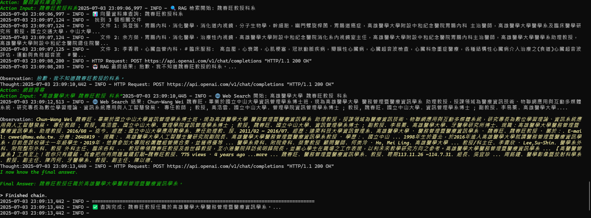

# RAG-Agent-Websearch 醫療資訊查詢系統

一個結合 Retrieval-Augmented Generation (RAG) 與 ReAct Agent 架構的智能醫療資訊查詢系統。系統整合本地醫師資料庫與網路搜尋功能，能根據用戶問題自動選擇最合適的查詢方式，提供專業的醫療資訊回覆。

## 🚀 系統演示

### 查詢本地醫師資料

*系統成功查詢高雄醫學大學醫師的位置資訊*

### 智能推理與多工具協作

*展示 ReAct Agent 的推理過程，包含多步驟思考與行動*

### 醫療症狀查詢

*系統提供流感相關症狀的詳細醫療資訊*

### 網頁介面

*直觀的網頁介面，支援即時醫療資訊查詢*

## ✨ 專案特色

- **🤖 ReAct Agent 架構**：結合推理與行動，智能選擇查詢路徑
- **🔍 混合式檢索**：整合本地知識庫與即時網路搜尋
- **🏥 醫療專業**：專注於醫師資料和醫療資訊查詢
- **📊 詳細日誌**：完整記錄每次查詢的推理過程
- **🎯 高可擴展**：模組化設計，易於擴充新功能

## 🏗️ 系統架構

### ReAct Agent 工作流程

```
用戶問題 → ReAct Agent 推理 → 工具選擇 → 資料檢索 → 結果整合 → 專業回覆
```

1. **思考階段 (Thought)**：分析問題類型和查詢需求
2. **行動階段 (Action)**：選擇合適的工具執行查詢
3. **觀察階段 (Observation)**：處理查詢結果
4. **整合階段**：結合多個資料源生成最終回覆

### 核心工具

- **醫師資料庫查詢工具**
  - 基於 Chroma 向量資料庫
  - 使用 HuggingFace BGE-M3 嵌入模型
  - 支援醫師姓名、專長、學歷、經歷查詢

- **網路搜尋工具**
  - 整合 Google Serper API
  - 獲取最新醫療資訊和研究
  - 智能篩選和摘要搜尋結果

## 🛠️ 技術棧

| 類別 | 技術 | 用途 |
|------|------|------|
| **後端框架** | FastAPI | RESTful API 服務 |
| **AI 框架** | LangChain | Agent 和工具鏈管理 |
| **大語言模型** | OpenAI GPT-4o | 推理和回覆生成 |
| **向量資料庫** | Chroma | 本地知識庫存儲 |
| **嵌入模型** | HuggingFace BGE-M3 | 文本向量化 |
| **網路搜尋** | Google Serper API | 即時資訊檢索 |
| **伺服器** | Uvicorn | ASGI 應用伺服器 |

## 📁 專案結構

```
RAG-Agent-Websearch/
├── react_agent_api.py      # FastAPI 主後端
├── build_doctor_db.py      # 向量資料庫建構
├── doctors.json            # 醫師原始資料
├── chroma_db/             # Chroma 向量資料庫
├── client/                # 前端專案 (React/Vite)
├── test_*.py              # 測試檔案
├── requirements.txt       # Python 依賴
├── .env                   # 環境變數
└── README.md             # 專案說明
```

## 🚀 快速開始

### 1. 環境準備

```bash
# 建立虛擬環境
conda create -n rag-agent python=3.10
conda activate rag-agent

# 或使用 venv
python -m venv rag-agent
source rag-agent/bin/activate  # Linux/Mac
rag-agent\Scripts\activate     # Windows
```

### 2. 安裝依賴

```bash
git clone https://github.com/yourusername/RAG-Agent-Websearch.git
cd RAG-Agent-Websearch
pip install -r requirements.txt
```

### 3. 設定 API 金鑰

創建 `.env` 檔案：

```env
OPENAI_API_KEY=your_openai_api_key_here
SERPER_API_KEY=your_serper_api_key_here
```

**取得 API 金鑰：**
- OpenAI API: https://platform.openai.com/account/api-keys
- Serper API: https://serper.dev/

### 4. 建立向量資料庫

```bash
python build_doctor_db.py
```

### 5. 啟動服務

```bash
# 啟動後端 API
python react_agent_api.py

# 啟動前端 (可選)
cd client
npm install
npm run dev
```

### 6. 測試系統

```bash
# 執行測試
python test_agent_tool.py

# 或使用 curl 測試 API
curl -X POST "http://localhost:8000/api/ask" \
  -H "Content-Type: application/json" \
  -d '{"question": "林宗翰醫師的專長是什麼？"}'
```

## 📝 API 文檔

### 問答端點

**POST** `/api/ask`

**請求格式：**
```json
{
  "question": "您的問題"
}
```

**回應格式：**
```json
{
  "result": "AI 生成的回覆",
  "execution_time": "查詢執行時間"
}
```

**範例：**
```bash
curl -X POST "http://localhost:8000/api/ask" \
  -H "Content-Type: application/json" \
  -d '{"question": "什麼是流感的主要症狀？"}'
```

## 🎯 使用範例

### 醫師資料查詢
```
問題：林宗翰醫師的專長是什麼？
回覆：林宗翰醫師專精於心臟血管內科，具有豐富的臨床經驗...
```

### 醫療資訊查詢
```
問題：流感的主要症狀是什麼？
回覆：流感的主要症狀包括突然發燒、咳嗽、喉嚨痛、肌肉疼痛...
```

### 複合查詢
```
問題：我需要心臟科醫師，同時想了解最新的高血壓治療方法
回覆：為您推薦專業的心臟科醫師，同時提供最新的高血壓治療資訊...
```

## 🔧 自訂設定

### 修改嵌入模型

```python
# 在 react_agent_api.py 中
embeddings = HuggingFaceEmbeddings(
    model_name="BAAI/bge-m3",  # 可替換為其他模型
    model_kwargs={'device': 'cpu'},
    encode_kwargs={'normalize_embeddings': True}
)
```

### 新增醫師資料

```json
// 在 doctors.json 中新增
{
  "name": "醫師姓名",
  "specialty": "專科領域",
  "education": "學歷背景",
  "experience": "工作經歷",
  "location": "工作地點"
}
```

### 擴充工具功能

```python
# 新增自訂工具
@tool
def custom_medical_tool(query: str) -> str:
    """自訂醫療查詢工具"""
    # 實作您的邏輯
    return "查詢結果"

# 註冊到 Agent
tools = [rag_tool, web_search_tool, custom_medical_tool]
```
# 醫師資料前處理系統 (Doctor Data Preprocessing System) (build_vectorv2.py)

## 📋 專案概述

本系統專門用於處理醫師資料，將其轉換為適合向量搜尋的格式，並建立高效的 ChromaDB 向量資料庫。系統採用智能切割策略，針對醫學專業術語進行優化，提供高精度的醫師資訊檢索功能。

## 📝 系統架構

### 核心組件

1. **DoctorDataProcessor** - 醫師資料處理器
2. **智能切割策略** - 自適應文字分割
3. **醫學術語標準化** - 同義詞字典管理
4. **向量資料庫建構** - ChromaDB 整合
5. **資料驗證與清理** - 品質控制機制

## 主要功能

### 1. 資料清理與標準化

#### 文字清理功能
```python
def clean_text(self, text: str) -> str:
    """增強的文字清理功能"""
    # 移除多餘空白
    # 移除編號前綴 (如 "1)", "2)" 等)
    # 移除特殊標記 (如 "<執照>", "<學會>" 等)
    # 標準化標點符號
    # 標準化英文數字格式
    # 移除特殊字符但保留醫學相關符號
```

#### 醫學術語標準化
- **職稱標準化**：主治醫師、住院醫師、主任、教授等
- **專科標準化**：心臟血管內科、心臟內科、心血管內科等
- **醫院名稱標準化**：高雄醫學大學附設中和紀念醫院、高醫附院等
- **學位標準化**：學士、碩士、博士、醫學士等

### 2. 智能切割策略

#### 切割類型
1. **基本資訊片段** - 醫師姓名、科別、主要專長
2. **專長片段** - 當專長超過8項時自動分組
3. **現任職位片段** - 職稱資訊
4. **經歷片段** - 按時間軸分組的工作經歷
5. **學歷片段** - 教育背景
6. **認證片段** - 專科認證資訊

#### 切割邏輯
```python
def chunk_doctor_data_smart(doctor: Dict[str, Any], processor: DoctorDataProcessor):
    # 根據資料內容和長度採用不同的切割策略
    # 專長 > 8項 → 分組切割
    # 經歷 > 6項且有時間軸 → 按時間分組
    # 認證 > 8項 → 分組切割
```

### 3. 資料驗證機制

#### 必要欄位檢查
- 醫師姓名 (`name`)
- 科別 (`department`)
- 至少有一個專長或職稱

#### 資料完整性驗證
```python
def validate_doctor_data(self, doctor: Dict[str, Any]) -> bool:
    """驗證醫師資料完整性"""
    required_fields = ['name', 'department']
    # 檢查必要欄位
    # 檢查專長或職稱資訊
```

### 4. 醫學資訊提取

#### 正則表達式模式
```python
self.medical_patterns = {
    'years': r'\b(19|20)\d{2}\b|民國\d{1,2}年',
    'medical_degrees': r'(學士|碩士|博士|Bachelor|Master|Doctor|PhD|醫學士)',
    'medical_specialties': r'(內科|外科|婦產科|小兒科|精神科|皮膚科|眼科|耳鼻喉科|骨科|泌尿科|放射科|麻醉科|病理科|復健科|家醫科|心臟科|心臟血管內科)',
    'certifications': r'(專科醫師|指導醫師|會員|會士|證書|執照)',
    'positions': r'(主任|副主任|主治醫師|住院醫師|總醫師|教授|副教授|助理教授|講師)'
}
```

## 📋 同義詞字典

### 職稱同義詞
| 標準術語 | 同義詞 |
|---------|--------|
| 主治醫師 | 主治、attending physician、主治醫生 |
| 住院醫師 | 住院、resident、住院醫生 |
| 主任 | director、chief、科主任、部主任 |
| 教授 | professor、prof |

### 專科同義詞
| 標準術語 | 同義詞 |
|---------|--------|
| 心臟血管內科 | 心臟內科、心血管內科、cardiology、心內科、心臟科 |
| 心臟超音波 | 心臟超音波檢查、echocardiography |
| 介入性治療 | 介入治療、interventional therapy、心導管介入治療 |
| 重症醫學 | 重症照護、intensive care、加護病房 |

### 醫院名稱標準化
| 標準名稱 | 簡稱 |
|---------|------|
| 高雄醫學大學附設中和紀念醫院 | 高醫附院、中和醫院、中和紀念醫院 |
| 高雄醫學大學附設高醫岡山醫院 | 高醫岡山醫院、岡山醫院 |
| 高雄市立小港醫院 | 小港醫院 |
| 高雄市立大同醫院 | 大同醫院 |

## 🚀 使用方式

### 1. 基本使用

```python
# 建立處理器
processor = DoctorDataProcessor("doctorsv3.json")

# 建立向量資料庫
build_doctor_vector_db(
    data_source="doctorsv3.json",
    custom_source_name="高醫心臟科醫師名單v3",
    use_smart_chunking=True
)
```

### 2. 測試模式

```bash
# 執行測試模式
python build_vector2.py test
```

### 3. 查詢集合

```python
# 使用 list_collections.py 查詢現有集合
python list_collections.py
```

## 📋 處理統計

### 資料處理結果
- **總醫師數**: 174 位
- **向量片段數**: 895 個
- **平均專長數**: 4.85 項
- **科別分布**: 14 個不同科別
- **醫院分布**: 4 個主要醫院

### 科別分布
1. 胸腔內科: 28 位 (16.1%)
2. 心臟血管內科: 25 位 (14.4%)
3. 內分泌新陳代謝內科: 19 位 (10.9%)
4. 胃腸內科: 18 位 (10.3%)
5. 肝膽胰內科: 18 位 (10.3%)

### 醫院分布
1. 高雄醫學大學附設中和紀念醫院: 45 位 (25.9%)
2. 高雄市立小港醫院: 10 位 (5.7%)
3. 高雄市立大同醫院: 10 位 (5.7%)
4. 高雄醫學大學附設高醫岡山醫院: 4 位 (2.3%)

## 🔍 搜尋測試

### 測試查詢範例
```python
test_queries = [
    "心臟內科高血壓專家",
    "林宗憲醫師",
    "高醫附院心臟科主任",
    "心導管介入治療",
    "心臟超音波檢查",
    "肺動脈高壓治療",
    "心肌病變專家",
    "瓣膜性心臟病",
    "重症醫學專科醫師",
    "介入性心臟血管治療"
]
```

### 搜尋結果格式

測試查詢: 心臟內科高血壓專家
結果 1 (相似度: 0.892): 林宗憲 - 心臟血管內科主治醫師，專長：高血壓...
結果 2 (相似度: 0.845): 王大明 - 心臟內科主任，專長：心血管疾病...


## 📁 輸出檔案

### 處理後資料
- `processed_doctors_smart_YYYYMMDD_HHMMSS.json` - 處理後的醫師資料
- `stats_YYYYMMDD_HHMMSS.json` - 統計報告

### 向量資料庫
- `chroma_db/` - ChromaDB 資料庫目錄
- 集合名稱: `doctors_smart_YYYYMMDD_HHMM`

## 🛠️ 技術規格

### 依賴套件
```python
import json
import re
import chromadb
from sentence_transformers import SentenceTransformer
from typing import List, Dict, Any, Optional
import logging
from datetime import datetime
from collections import Counter
```

### 向量模型
- **模型**: BAAI/bge-m3
- **語言**: 多語言支援（中英文）
- **維度**: 1024
- **正規化**: 啟用

### 資料庫
- **類型**: ChromaDB
- **持久化**: 啟用
- **索引**: 向量相似度搜尋
- **元數據**: 豐富的醫師資訊標籤

## ⭐特色功能

### 1. 智能切割
- 根據資料內容自動選擇切割策略
- 保持語義完整性的同時優化搜尋效果
- 支援長專長列表的智能分組

### 2. 醫學術語優化
- 專業的醫學同義詞字典
- 支援中英文混合搜尋
- 標準化醫學術語表達

### 3. 資料品質控制
- 完整的資料驗證機制
- 自動清理和標準化
- 詳細的處理日誌

### 4. 高效能處理
- 批次處理大量醫師資料
- 並行向量化處理
- 記憶體優化的切割策略

## ⭐自訂設定

### 修改同義詞字典
```python
# 在 DoctorDataProcessor.__init__() 中修改
self.synonym_dict = {
    "新術語": ["同義詞1", "同義詞2", "英文術語"],
    # ... 更多術語
}
```

### 調整切割參數
```python
# 在 chunk_doctor_data_smart() 中修改
if len(doctor['specialty']) > 8:  # 調整閾值
    specialty_groups = [doctor['specialty'][i:i+8] for i in range(0, len(doctor['specialty']), 8)]
```

### 新增正則表達式模式
```python
# 在 medical_patterns 中新增
'new_pattern': r'(新的正則表達式模式)',
```
---

## 🐛 常見問題

### Q: 模型下載很慢怎麼辦？
**A:** 可以手動下載模型到本地並指定路徑，或使用鏡像站點。

### Q: API 金鑰無效
**A:** 請確認 `.env` 檔案格式正確，且金鑰未過期。

### Q: Chroma 資料庫錯誤
**A:** 刪除 `chroma_db/` 目錄後重新執行 `build_doctor_db.py`。

### Q: 前端 CORS 問題
**A:** 已在 FastAPI 中設定 CORS，如有問題請檢查 `CORSMiddleware` 設定。

## 📊 效能指標

- **查詢回應時間**：平均 2-5 秒
- **本地檢索精確度**：> 95%
- **網路搜尋整合**：自動判斷觸發
- **同時併發處理**：支援多用戶查詢

## 🤝 貢獻指南

1. Fork 本專案
2. 建立功能分支 (`git checkout -b feature/AmazingFeature`)
3. 提交更改 (`git commit -m 'Add some AmazingFeature'`)
4. 推送到分支 (`git push origin feature/AmazingFeature`)
5. 建立 Pull Request

## 📄 授權

本專案採用 MIT 授權條款 - 詳見 [LICENSE](LICENSE) 檔案。

## 🙏 致謝

- OpenAI 提供強大的 GPT-4o 模型
- HuggingFace 提供優秀的嵌入模型
- LangChain 提供完整的 Agent 框架
- Chroma 提供高效的向量資料庫

## 📞 聯絡我們

- 專案連結: (https://github.com/Tsai1030/Langchain-ReAct-Agent/tree/main)
- 問題回報: (https://github.com/Tsai1030/Langchain-ReAct-Agent/tree/main)
- 電子郵件: pijh102511@gmail.com
- **版本**: v3.0
- **更新日期**: 2025-07-04

---

⭐ 如果這個專案對您有幫助，請給我們一個 Star！
